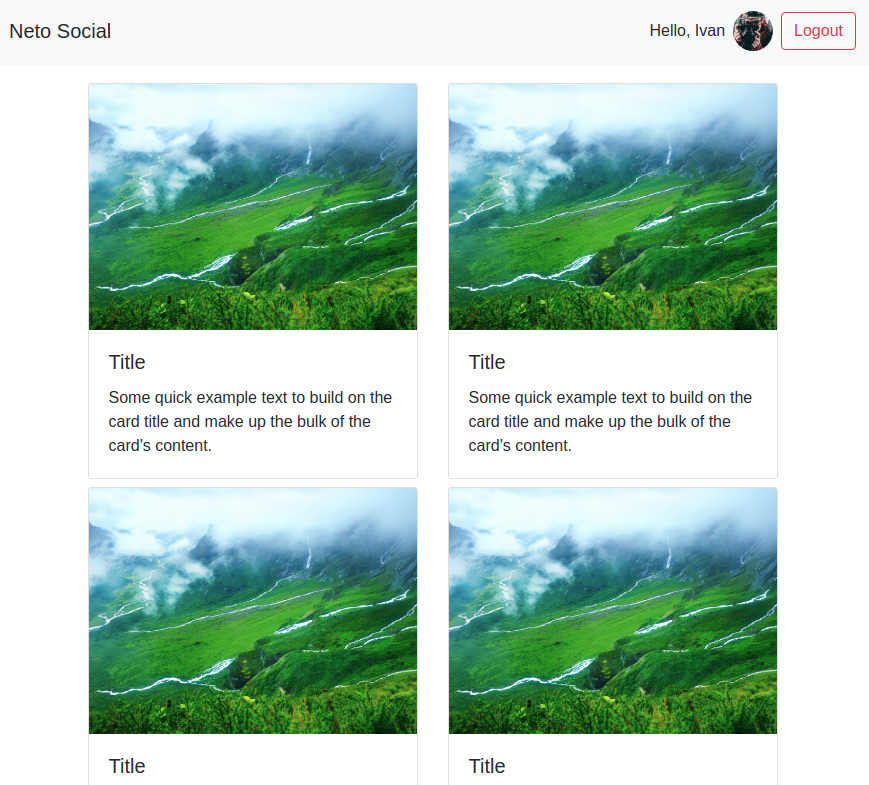

<a name="top"></a>
# Authentication

[вернуться в корневой readme](../README.md)


- [Задание](#задание)
- [Решение](#решение)

## Задание
Вы решили построить систему с аутентификацией.

Используя сервер, расположенный в каталоге *backend*, реализуйте приложение, удовлетворяющее следующим условиям:
1. При первой загрузке показывается лэндинг с формой входа:  


2. После авторизации (POST http://localhost:7070/auth *{"login": "vasya", "password": "password"}*) загружаются компоненты ленты новостей и в тулбаре отображается профиль с кнопкой «Выйти»:  


Для запроса профиля используйте запрос вида:
```
GET http://localhost:7070/private/me
Authorization: Bearer <ваш_токен>
```

Для запроса новостей используйте запрос вида:
```
GET http://localhost:7070/private/news
Authorization: Bearer <ваш_токен>
```

Важно:
1. Профиль и токен должны храниться в localStorage/sessionStorage. При перезагрузке страницы должна также загружаться лента новостей, если мы аутентифицированы.
2. Должна быть обработка ошибок, если получена ошибка 401, то нужно разлогинивать пользователя — удалять всё из localStorage/sessionStorage.
3. Не используйте React Router, просто подменяйте компоненты в зависимости от текущего состояния аутентификации.

[Вверх](#top)

## Решение
### Заметки к бэку:
- вместо библиотеки faker использован faker-js, так как репозиторий faker удален
- добавлен пакет dotenv, для того, чтобы использовать файл .env в коде (process.env.PORT)

### Заметки к фронту:

Раз у нас есть требование о хранении состояния при перезагрузке страницы, то выбор сделан в пользу *localStorage*

Используем useContext

Приложение состоит из двух крупных компонентов:
- Header
- Main

Содержимое обоих компонентов зависит  от контекста isAuthenticated

Header неавторизованный  
Header авторизованный - тянет профиль из localStorage

Main неавторизованный  
Main авторизованный тянет новости из API

### Логика в картинках
Запуск приложения  


Вход пользователя  


Выход пользователя  


Перезагрузка = Запуск приложения


[Вверх](#top)
