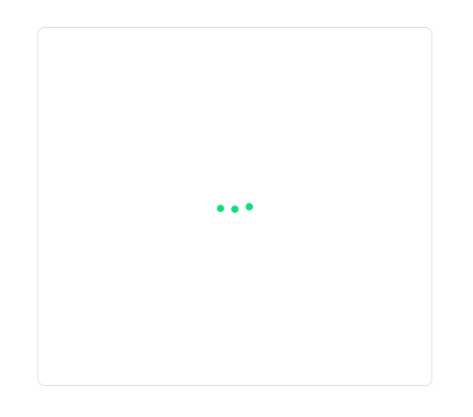

<a name="top"></a>
# Список и детали

[вернуться в корневой readme](../README.md)


- [Задание](#задание)
- [Решение](#решение)

## Задание
Вы решили потренироваться в использовании хука *useEffect* и реализовать следующее приложение — список с пользователями, в котором при клике на пользователя рядом появляется окно, отображающее детальную информацию о нём:
```json
{
    "id": 9,
    "name": "Dr. Grady Abernathy",
    "avatar": "https://i.pravatar.cc/300",
    "details": {
        "city": "South Angelicaberg",
        "company": "Schneider and Sons",
        "position": "District Response Facilitator"
    }
}
```  
  
При первой загрузке ни один из элементов не выбран, поэтому отображается только список:  
 


## Механика
Назовём первый компонент слева *List*, а второй справа — *Details*.  
Реализуйте следующую логику:
- При загрузке приложения один раз делается запрос по адресу https://raw.githubusercontent.com/netology-code/ra16-homeworks/master/hooks-context/use-effect/data/users.json и отрисовывается список в компоненте List.
- При клике на конкретный элемент списка в компонент Details передаётся один props: info (объект с полями id и name) и начинается загрузка данных по адресу: https://raw.githubusercontent.com/netology-code/ra16-homeworks/master/hooks-context/use-effect/data/{id}.json, где {id} — это ID пользователя из props.
- На время загрузки можете отображать индикатор загрузки. Протестируйте с помощью выставления ограничения пропускной способности сети в Dev Tools.

Важные моменты:
- Вся загрузка должна происходить через хук *useEffect*. Подумайте, как организовать единоразовую загрузку и загрузку при каждом изменении *props.info.id*.
- Обратите внимание, загрузка деталей должна происходить только при изменении *props.info.id*, а не при каждом рендере. То есть если на одного и того же пользователя кликнуть дважды, то загрузка произойдёт только в первый раз.

[Вверх](#top)

## Решение

К сервису картинок есть вопросы, т.к. он работает только под тремя буквами и по одинаковому адресу отдаёт разные картинки. Из-за этого пришлось исхитряться с кешированием, т.к. у разных элементов были бы одинаковые адреса картинок и они бы у всех одинаковые из-за кеширования в самом браузере.

При работе с сетевыми вызовами добавлена функция delay для замедления загрузки (подсмотрел в лекции).

Добавлен прелоадер для анимации ожидания получения сетевых данных.

Работа с хуками реализована разными способами:
1) загрузка приложения релизована с кастомным хуком useData дял одноразовой загрузки списка пользователей.
2) загрузка детальных данных реализована с хуком UseEffect с зависимостью от id пользователя и состояния кешированных данных  
(чтобы fetch детальных даных срабатывал при изменении id либо отсутствии данных в кэше)

Таким образом, после загрузки списка пользователей клик по элементу списка приводит либо к загрузке детальных данных, их кешированию и отображению,  
либо к мгновенному отображению, если данные ранее были загружены.

Скриншоты:  
Загрузка приложения в моменте получения списка пользователей  
  

Приложение с отрисованным списком пользователей, ни один элемент не выбран  


Приложение с выбранным элементом списка в моменте получения детальных данных из сети  


Приложение с выбранным элементом списка и выводом детальных данных  


[Вверх](#top)