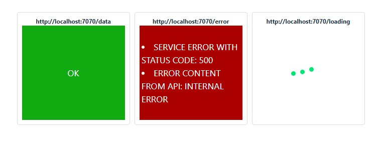
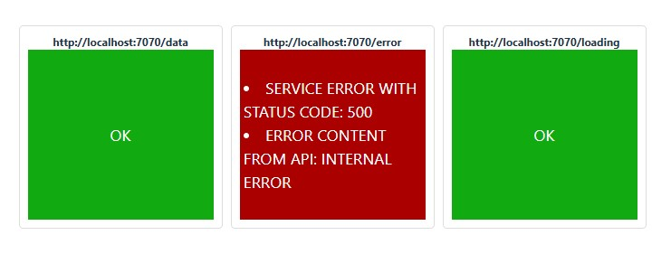

<a name="top"></a>
# useJsonFetch

[вернуться в корневой readme](../README.md)


- [Задание](#задание)
- [Решение](#решение)

## Задание
Реализуйте кастомный хук *useJsonFetch*, который позволяет с помощью fetch осуществлять HTTP-запросы.  
Использование этого хука должно выглядеть следующим образом:
```js
const [data, loading, error] = useJsonFetch(url, opts);
```

где:
* data — данные, полученные после response.json(), не Promise, а именно данные;
* error — ошибка: ошибка сети, ошибка ответа, если код не 20x, ошибка парсинга, если пришёл не JSON;
* loading — boolean флаг, сигнализирующий о том, что загрузка идёт.

Покажите использование этого хука на примере трёх компонентов, каждый из которых делает запросы на следующие адреса:
* GET http://localhost:7070/data — успешное получение данных;
* GET http://localhost:7070/error — получение 500 ошибки;
* GET http://localhost:7070/loading — индикатор загрузки.

Backend возьмите из каталога *backend*.


[Вверх](#top)

## Решение

Реализован хук useJsonFetch, ошибки в нем собираем в массив - кроме http-статуса ответа ловим и пытаемся разобрать содержимое ответа.  
Возможно, надо было делать через try/catch.  

Немного грязновато, так как сервер может ответить просто статусом 500 или 400, но предполагается, что у нас API задокументировано ;).

Реализован компонент, работающий с этим хуком, отображающий прелоадер в зависимости от состояния данных.

В корневом компоненте на основе трех вариантов адресов API отображаются компоненты приложения, использующие эти адреса.

Скриншот решения в моменте, когда ожидается ответ от API loading, виден прелоадер    



Скриншот решения с ответами от всех трёх API    


[Вверх](#top)